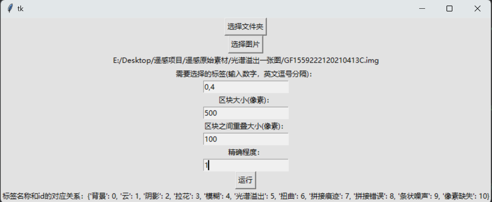

# remote_sense_image_quality_inspection
# 智能化遥感图像质量检测系统

## 运行方法
主程序为 "界面.py"，直接运行后如图所示。可以选择图片或包含多个图片的文件夹，输入框中内容可不填，点击运行即可开始检测。

检测完毕后会在图片相同的目录下生成一个 .shp 文件，可以用 ArcGIS 或者 QGIS 打开查看检测结果。

## 论文
论文：[《An intelligent remote sensing image quality inspection system》](https://ietresearch.onlinelibrary.wiley.com/doi/10.1049/ipr2.12977)

## 模型下载
完整的图像分类模型、语义分割模型的完整参数的下载地址：

1.[swin-v2-base-remote-sensing-quality](https://huggingface.co/yuyijiong/swin-v2-base-remote-sensing-quality)

2.[segformer-b5-remote-sensing-quality](https://huggingface.co/yuyijiong/segformer-b5-remote-sensing-quality)

## 训练数据下载
[数据集](https://cloud.tsinghua.edu.cn/d/7b3167ee4b8d4242a8d1/)
