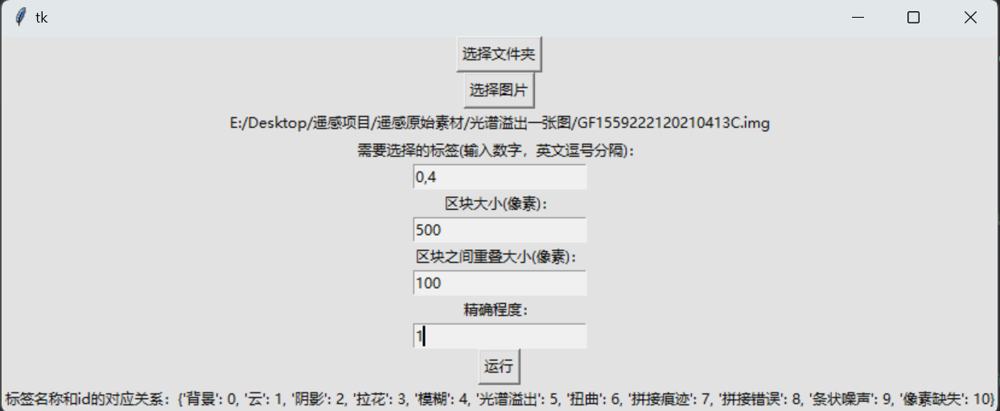

# remote_sense_image_quality_inspection
# 智能化遥感图像质量检测系统

## 运行方法
主程序为 "界面.py"，直接运行后如图所示。
1. 检测单张图片：点击“选择图片”，选择单张图片的路径。
2. 检测多张图片：点击“选择文件夹”，可以同时检测文件夹里面的所有图片。
   
选择完毕后，点击运行即可开始检测。检测完毕后会在图片相同的目录下新建一个与图片名字一样的文件夹，文件夹里面是 .shp 文件，可以用 ArcGIS 或者 QGIS 打开查看检测结果。

### 其他可选参数（可以不填写）：
1. 需要选择的标签：想要检测的类别，类别与数字的对应关系写在界面最下面。例如，如果只想检测 云和阴影，则输入"1,2"
2. 区块大小：检测时，将图片切分为区块时的区块大小，默认为500 。值越大检测速度越快，但精确度越低。
3. 区块之间重叠大小：检测时，将图片切分为区块时，区块之间的重叠程度，默认为100 。值越大检测速度越慢，但精度更高。
4. 精确程度：控制检测的严格程度的系数，默认为1 。值越大（例如设为10），则判断为错误区域的标准越严格，被检测出的区域越少。

## 论文
论文：[《An intelligent remote sensing image quality inspection system》](https://ietresearch.onlinelibrary.wiley.com/doi/10.1049/ipr2.12977)

## 模型下载
完整的图像分类模型、语义分割模型的完整参数的下载地址：

1.[swin-v2-base-remote-sensing-quality](https://huggingface.co/yuyijiong/swin-v2-base-remote-sensing-quality)

2.[segformer-b5-remote-sensing-quality](https://huggingface.co/yuyijiong/segformer-b5-remote-sensing-quality)

## 训练数据下载
[数据集](https://cloud.tsinghua.edu.cn/d/7b3167ee4b8d4242a8d1/)
